# Hi, I'm NichiyaOba

<!-- ABOUT_START -->
Software Engineer based in Japan.

<!-- ABOUT_END -->

## Tech Stack

<!-- TECH_STACK_START -->
### Languages

### Application

### Infrastructure

### Others

<!-- TECH_STACK_END -->

## GitHub Stats

### Contributions

<!-- FOOTER_START -->

<!-- FOOTER_END -->
